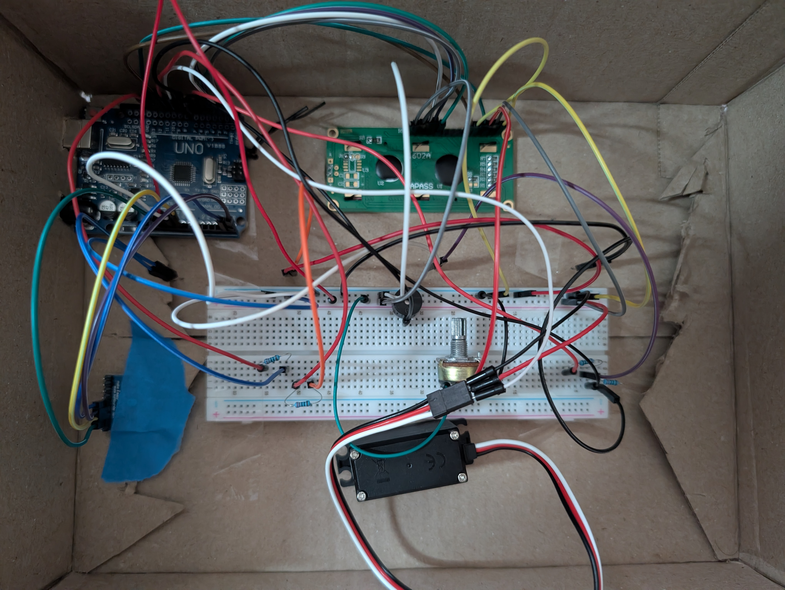
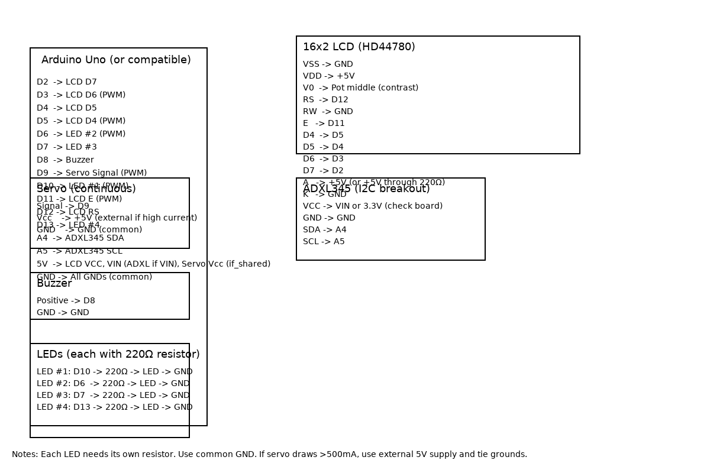
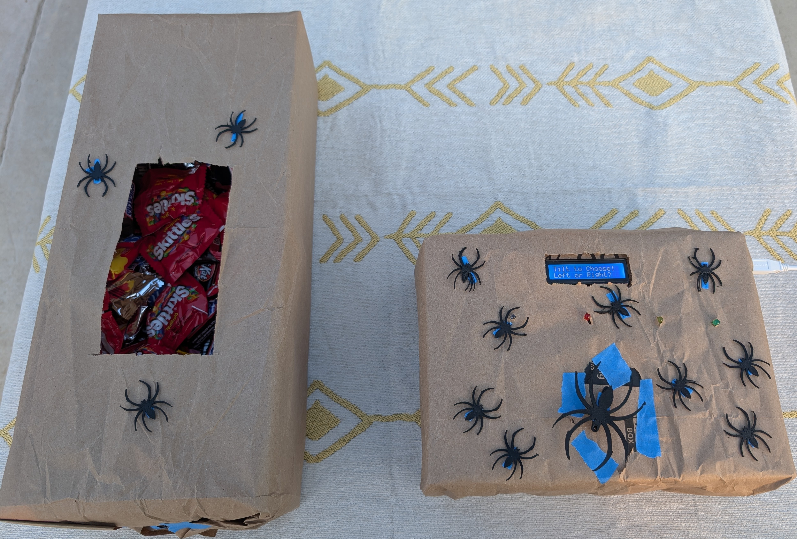
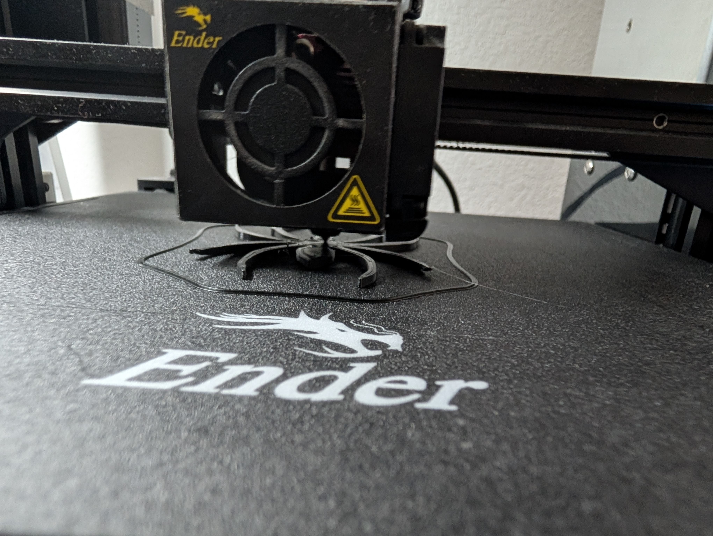

# 🎃 Tilt-or-Treat: The Motion-Activated Halloween Candy Game

Bring some spooky magic to your Halloween setup!\
Tilt the box left or right --- will you get a **treat**, or will the
**ghosts come for you**?\
This Arduino-powered project uses an **ADXL345 accelerometer** to detect
motion and trigger either a trick or treat response.

------------------------------------------------------------------------

## 🧩 Features

-   Randomized "Trick" or "Treat" outcomes
-   Animated LED effects
-   Spooky sound effects with a buzzer
-   Servo motor for chaotic tricks
-   LCD display for haunted messages

------------------------------------------------------------------------

## ⚙️ Components Needed

  Component                       Quantity   Notes
  ------------------------------- ---------- --------------------------
  Arduino Uno (or compatible)     1          Microcontroller
  ADXL345 Accelerometer           1          Detects tilt
  16×2 LCD (HD44780 compatible)   1          Displays text
  Servo Motor (continuous)        1          Spins during "Trick"
  LEDs                            4          For visual effects
  220 Ω resistors                 4--5       For LEDs & LCD backlight
  Buzzer                          1          For sound effects
  Potentiometer (10 kΩ)           1          LCD contrast
  Jumper Wires                    several    
  Breadboard                      1          For building circuit
  (Optional) 470 µF capacitor     1          To stabilize servo power

------------------------------------------------------------------------

## 🔌 Circuit Diagram

**Notes:** - Each LED must have its own 220 Ω resistor. - All LED
cathodes (short legs) connect to a common GND line. - ADXL345 can be
powered from 5V **only if** your breakout board has a VIN pin (with
built-in regulator). - LCD A → +5V (through 220 Ω resistor if needed), K
→ GND.

------------------------------------------------------------------------

## 💾 How It Works

-   Tilt left or right to trigger the accelerometer.
-   A random choice is made: **Trick** or **Treat**.
-   **Trick:** Servo spins wildly, LEDs flash fast, spooky sound plays.
-   **Treat:** LEDs blink gently, happy tones play, and you're safe...
    for now 👻.

------------------------------------------------------------------------

## 🧠 Credits

-   Project by **Raoul Mendanha**
-   Built with Arduino IDE

------------------------------------------------------------------------

## 📸 Images

        
  ------------------------------ ------------------------------

------------------------------------------------------------------------

## 🪦 License

This project is licensed under the [MIT License](LICENSE).\
Feel free to share, remix, or build your own haunted contraptions ---
just keep the credits!

------------------------------------------------------------------------

🎃 Happy Haunting and Happy Coding!
